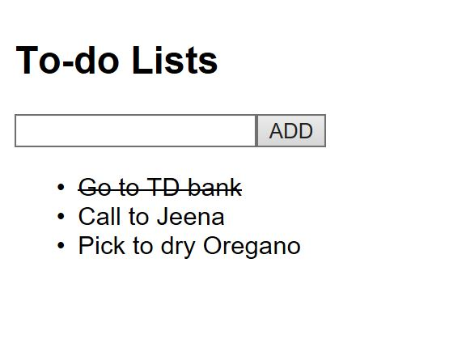
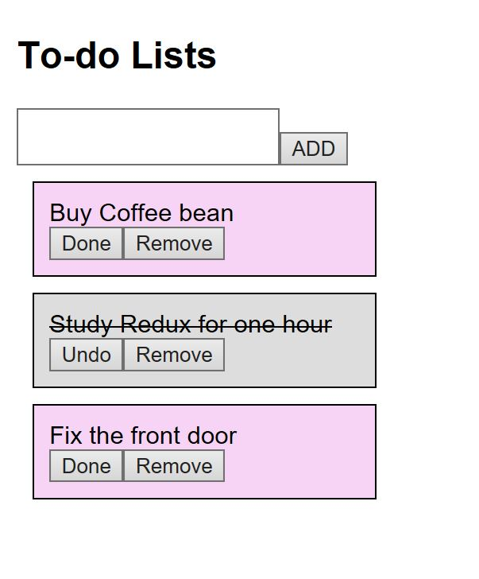

# React_Redux_toDoList

@ June 2019

ToDoList App with React Redux

Focused on Immutable.js

> 1. Components

App

Todos

Container/TodosContainer

> 2.  Actions for todos store : store/todo.js
 
INSERT

TOGGLE

REMOVE

> 3. Used immutable List 

  Components/Todos.js
  
  can set todos using List and Map for data and array
         
         import { List, Map } from 'immutable';
         
         ...
         
         Todos.defaultProps = {
           todos: List([
             Map({
               id: 0,
               text: 'Go to TD',
               checked: false
             }),
             Map({
               id: 1,
               text: 'Study Redux',
               checked: true
             })
           ]),
           input: ''
         };

> 4. View feature of the first version 

To add new todo, input text into text-box.

To remove, double-click an item.

To make todo be done, click an item.

> 

Using immutable js, can call 'update', 'updateIn', or 'deleteIn' to change state and call 'get' to get state.

  src/store/modules/todo.js
         
        import { List, Map } from 'immutable';
        
        ...
        
         const initialState = Map({
           input: '',
           todos: List()
         });
        
        ...
        
         export default handleActions({ 
           [CHANGE_INPUT]: (state, action) => state.set('input', action.payload),
           
           [INSERT]: (state, { payload: text }) => {             
             const item = Map({ id: id++, checked: false, text });  
             return state.update('todos', todos => todos.push(item));
           },
           
           [TOGGLE]: (state, { payload: id }) => { 
             const index = state.get('todos').findIndex(item => item.get('id') === id);
             return state.updateIn(['todos', index, 'checked'], checked => !checked);
           },
           
           [REMOVE]: (state, { payload: id }) => {              
             const index = state.get('todos').findIndex(item => item.get('id') === id);
             return state.deleteIn(['todos', index]);
           }
         }, initialState);

> 5. Feature Upgrades 

Can make 'Undo' after making 'Done'

Show the different background according to item's state, done or not 

